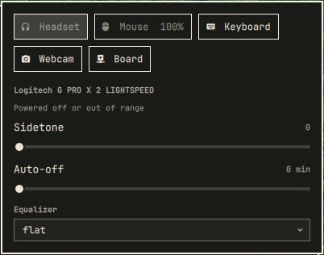
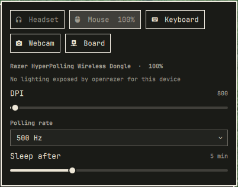
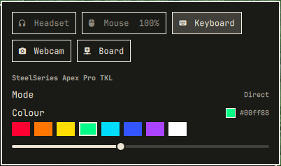
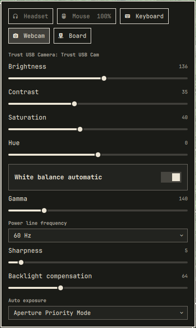

# omaperi

One Omarchy bar widget for every peripheral — headset, mouse, keyboard, webcam —
rendering whatever each device actually exposes.

Most peripheral plugins are built per vendor: one for Razer, one for OpenRGB, one
for headsets. omaperi is built per *capability*. Each adapter asks a tool that
already knows the device and translates the answer into one uniform document;
the panel renders that document. Nothing in the QML knows what a Razer is.

```
headsetcontrol -o json   →  ┐
openrazer (python)       →  ├─  omaperi status  →  one capability document  →  panel
openrgb --list-devices   →  │
v4l2-ctl --list-ctrls    →  ┘
```

## What you get

| Device class | Backend | Typical controls |
|---|---|---|
| Headsets | `headsetcontrol` | battery, sidetone, EQ preset, auto-off, mic LED, chatmix |
| Razer mice/keyboards | `openrazer` | battery, DPI, polling rate, sleep timer, lighting |
| Anything OpenRGB sees | `openrgb` | mode, colour |
| Webcams | `v4l2-ctl` | brightness, contrast, white balance, exposure, power-line frequency |

The panel is tabbed, one tab per device: a glyph, a short kind name ("Mouse",
not the product string), and the battery where there is one. A device that
cannot report right now still gets a tab, dimmed.

Only what a device really has appears. A headset without lights shows no light
switch; a mouse whose dongle exposes no lighting says so instead of offering a
control that does nothing.

## Screenshots

One slot in the bar, whatever `barMode` you pick:


One tab per device, each showing only the controls that device really has:

| Headset | Mouse | Keyboard |
|---|---|---|
|  |  |  |

The headset is powered off and says so instead of offering controls that would
do nothing; the mouse reports that OpenRazer exposes no lighting through its
dongle; the keyboard's single OpenRGB mode is shown as a value rather than a
dropdown pretending to be a choice.

A webcam, whose ten V4L2 controls are read straight off the device:



## Install

The widget needs the `omaperi` CLI on `PATH`:

```bash
install -Dm755 bin/omaperi ~/.local/bin/omaperi
omarchy plugin add https://github.com/Chimmy89/omaperi.git --enable
```

Then add it to the bar (Setup → Bar), or put `{"id": "io.github.chimmy89.omaperi"}`
in `~/.config/omarchy/shell.json`.

## Dependencies

omaperi itself needs only Python 3 (standard library) and Omarchy Quattro's
shell. Every backend is optional, detected at runtime, and hidden when absent —
install only what your hardware needs:

| Backend | Package | Covers | Licence |
|---|---|---|---|
| `headsetcontrol` | `headsetcontrol` | wireless headsets | GPL-3.0 |
| `openrazer` | `openrazer-meta` (AUR) | Razer devices | GPL-2.0 |
| `openrgb` | `openrgb` | anything OpenRGB sees | GPL-2.0 |
| `v4l2` | `v4l-utils` | webcams | GPL-2.0 |

```bash
sudo pacman -S headsetcontrol openrgb v4l-utils   # as applicable
yay -S openrazer-meta                             # Razer devices
```

None are bundled or downloaded by omaperi; it only calls them if they are
already on `PATH`. `omaperi backends` prints which are live and why the others
are not.

## Removal

```bash
omarchy plugin remove io.github.chimmy89.omaperi
rm -f ~/.local/bin/omaperi
rm -rf ~/.local/state/omaperi     # remembered write-only values and the poll cache
```

Remove the widget from `bar.layout` in `~/.config/omarchy/shell.json` if you
added it there by hand. omaperi writes nothing else: no system files, no
services, no udev rules, and it never edits your configuration for you.

### Bar presentation

`barMode` (in the widget's `shell.json` entry) picks between:

- `summary` (default) — one fixed slot: the widget glyph plus the lowest
  battery among all devices, accent-coloured when low. The slot never changes
  width or disappears as devices sleep, so the click target stays put.
- `pills` — the glyph, then one slot per battery-bearing device. More
  at-a-glance detail, at the cost of a widget that changes width when a mouse
  goes to sleep.

## Usage

```bash
omaperi status                        # capability document as JSON
omaperi backends                      # adapter availability
omaperi apply v4l2:video0 brightness 180
omaperi apply headset:<vid>:<pid> eq_preset 1   # ids come from `omaperi status`
```

## Notes

- **OpenRGB is much faster with its server running.** Cold detection costs about
  1.4 s per call; against a running SDK server it is about 20 ms. Start it with
  `openrgb --server --startminimized` (that also gives you a tray icon).
- **OpenRGB colour cannot be read back.** OpenRGB has no state dump — only a
  binary `.orp` profile and an SDK server that is not running as a service on
  most systems — so the colour chip shows what omaperi last set rather than
  what the device is currently displaying.
- **Some controls are write-only.** `headsetcontrol` can set sidetone but cannot
  read it back, so omaperi remembers what it last sent in
  `~/.local/state/omaperi/state.json` and shows that.
- **Inactive v4l2 controls are hidden, not broken.** Exposure is owned by
  auto-exposure while that is on; turn the automatic control off and the manual
  one appears on the next poll.
- **Polling is locked and cached.** The bar runs one widget instance per monitor,
  and two concurrent `headsetcontrol` calls fight over the same HID device and
  both return empty — which reads exactly like "device is off".

## Testing without hardware

```bash
OMAPERI_DUMMY=1 omaperi status
```

registers one fake device exercising every control type — range, enum, toggle,
action, readout and colour — so the panel can be worked on with nothing
plugged in. It is off unless that variable is set.

## Adding a device

See [docs/adding-a-device.md](docs/adding-a-device.md). It is one function plus
one registry line, and never any QML.

## Tests

```bash
python3 tests/test_omaperi.py
```

No hardware or network needed — they cover the two hand-written parsers.

## License

MIT
